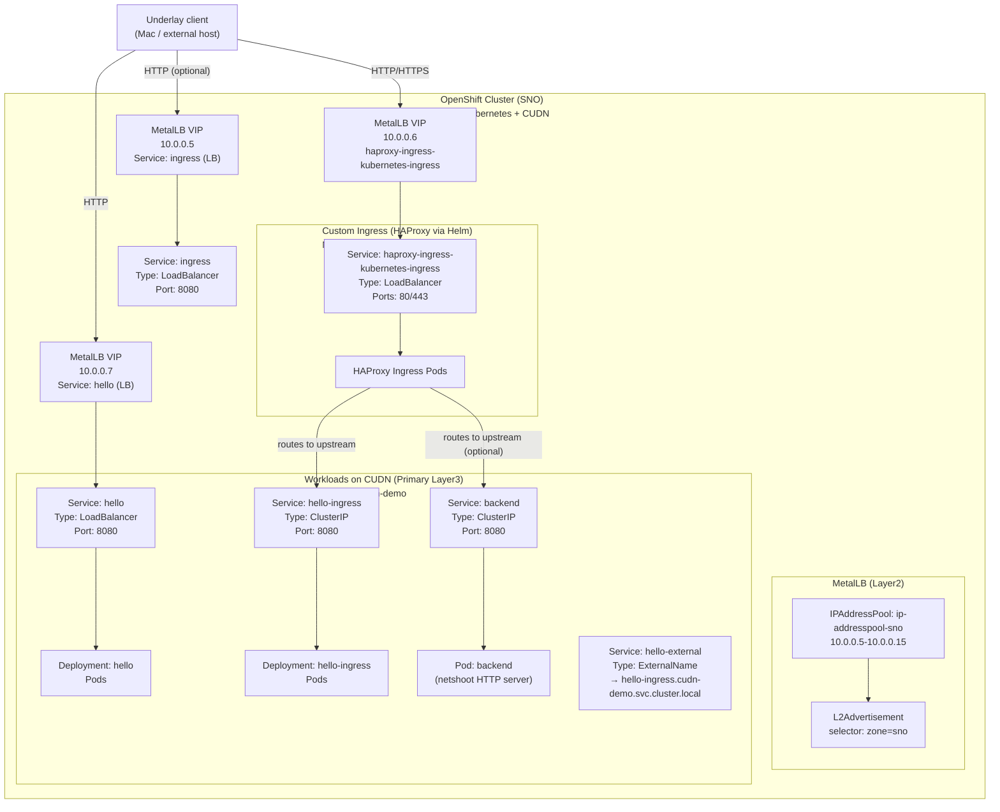

# PoC – Exposing CUDN Workloads to the Underlay Network using MetalLB and Custom Ingress

## Overview

This repository documents a Proof of Concept (PoC) that validates how workloads running on an
**OVN-Kubernetes Cluster User Defined Network (CUDN)** can be exposed to an **underlay network
(10.0.0.0/25)** using **MetalLB** and a **custom HAProxy ingress controller**.

---

## Environment

- **OpenShift**: 4.18.x
- **Kubernetes**: v1.31.x
- **CNI**: OVN-Kubernetes
- **Cluster type**: Single Node OpenShift (SNO), on‑prem
- **User Defined Networks**: ClusterUserDefinedNetwork (Layer3, Primary)
- **Load Balancer**: MetalLB (Layer2 mode)
- **Ingress**: HAProxy (custom Helm deployment)

---

## Architecture Pattern

```
[ Underlay Client ]
        |
        v
  MetalLB VIP (10.0.0.x)
        |
 Service (LoadBalancer)
        |
 Custom HAProxy Ingress (CUDN)
        |
 ClusterIP Service
        |
 Application Pod (CUDN Primary IP)
```

## Architecture diagram



### Key characteristics

- Pods use a **CUDN Layer3 primary network**
- Services of type `LoadBalancer` receive IPs from the **underlay subnet**
- Traffic enters the cluster through MetalLB
- A **custom ingress controller** handles HTTP routing
- The default OpenShift router is not used (it is not CUDN-aware)

---

## Underlay-Exposed Services (10.0.0.x)

The following services are exposed directly to the underlay network:

| Service name                          | Type         | External IP | Purpose |
|--------------------------------------|--------------|-------------|---------|
| haproxy-ingress-kubernetes-ingress   | LoadBalancer | 10.0.0.6    | Main ingress entry point (HTTP/HTTPS) |
| hello                                | LoadBalancer | 10.0.0.7    | Direct exposure of a test application |
| ingress                              | LoadBalancer | 10.0.0.5    | Auxiliary ingress test (optional) |

Only these services are expected to be reachable from the underlay network.

---

## MetalLB Configuration

MetalLB is configured in **Layer2 mode** to advertise IPs from the underlay network.

### IPAddressPool

- **Name**: `ip-addresspool-sno`
- **Range**: `10.0.0.5 – 10.0.0.15`
- **autoAssign**: enabled
- **Label**: `zone: sno`

### L2Advertisement

- Advertisement is based on a **label selector** (`zone: sno`)
- Suitable for Single Node OpenShift environments

All `LoadBalancer` services reference this pool via:

```yaml
metallb.io/address-pool: ip-addresspool-sno
```

---

## Custom HAProxy Ingress (Helm)

The default OpenShift router is not CUDN-aware.  
A custom **HAProxy ingress controller** is therefore deployed using Helm.

```
 $ helm repo add haproxytech https://haproxytech.github.io/helm-charts
 $ helm repo update
 $  helm install haproxy-ingress haproxytech/kubernetes-ingress -n cudn-demo -f ./values.yaml
```


Helm configuration is stored under:

```
helm/haproxy-ingress/
├── values.yaml
└── install.sh
```

To install the ingress controller:

```bash
bash helm/haproxy-ingress/install.sh
```

---

## Alternatives Evaluated

### ExternalName Services

`Service` objects of type `ExternalName` were evaluated .... [WIP]

---

## Conclusion

This PoC demonstrates a **clean and supportable architecture** for exposing CUDN-based workloads
to an underlay network using **MetalLB and a custom ingress controller**.

It avoids the operational and architectural limitations of Localnet Secondary networks and provides
a solid foundation for future evolution (e.g. BGP-based MetalLB).
