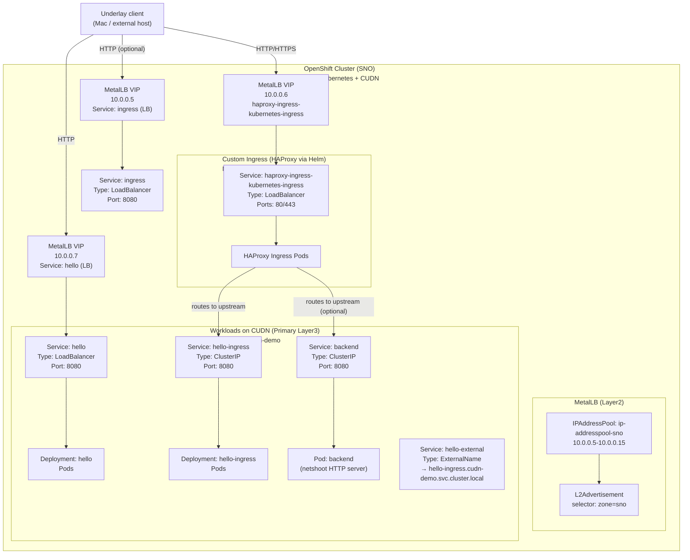
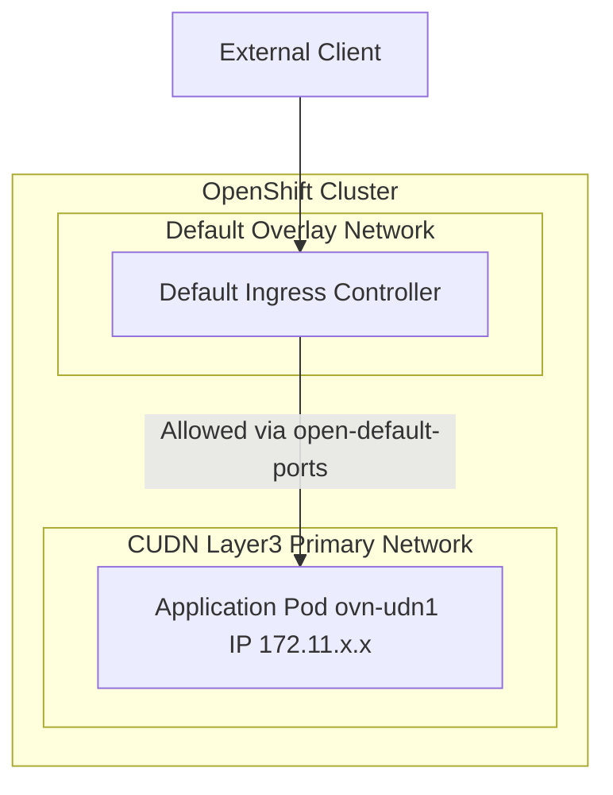
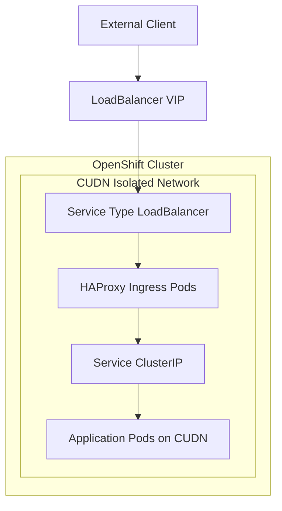

# PoC – Exposing CUDN Workloads to the Underlay Network using MetalLB and Custom Ingress

## Overview

This repository documents a Proof of Concept (PoC) that validates how workloads running on an
**OVN-Kubernetes Cluster User Defined Network (CUDN)** can be exposed to an **underlay network
(10.0.0.0/25)** using **MetalLB** and a **custom HAProxy ingress controller**.

---

## Environment

- **OpenShift**: 4.18.x
- **Kubernetes**: v1.31.x
- **CNI**: OVN-Kubernetes
- **Cluster type**: Single Node OpenShift (SNO), on‑prem
- **User Defined Networks**: ClusterUserDefinedNetwork (Layer3, Primary)
- **Load Balancer**: MetalLB (Layer2 mode)
- **Ingress**: HAProxy (custom Helm deployment)

---

## Architecture Pattern

```
[ Underlay Client ]
        |
        v
  MetalLB VIP (10.0.0.x)
        |
 Service (LoadBalancer)
        |
 Custom HAProxy Ingress (CUDN)
        |
 ClusterIP Service
        |
 Application Pod (CUDN Primary IP)
```

## Architecture diagram



### Key characteristics

- Pods use a **CUDN Layer3 primary network**
- Services of type `LoadBalancer` receive IPs from the **underlay subnet**
- Traffic enters the cluster through MetalLB
- A **custom ingress controller** handles HTTP routing
- The default OpenShift router is not used (it is not CUDN-aware)

---

## Underlay-Exposed Services (10.0.0.x)

The following services are exposed directly to the underlay network:

| Service name                          | Type         | External IP | Purpose |
|--------------------------------------|--------------|-------------|---------|
| haproxy-ingress-kubernetes-ingress   | LoadBalancer | 10.0.0.6    | Main ingress entry point (HTTP/HTTPS) |
| hello                                | LoadBalancer | 10.0.0.7    | Direct exposure of a test application |
| ingress                              | LoadBalancer | 10.0.0.5    | Auxiliary ingress test (optional) |

Only these services are expected to be reachable from the underlay network.

---

## MetalLB Configuration

MetalLB is configured in **Layer2 mode** to advertise IPs from the underlay network.

### IPAddressPool

- **Name**: `ip-addresspool-sno`
- **Range**: `10.0.0.5 – 10.0.0.15`
- **autoAssign**: enabled
- **Label**: `zone: sno`

### L2Advertisement

- Advertisement is based on a **label selector** (`zone: sno`)
- Suitable for Single Node OpenShift environments

All `LoadBalancer` services reference this pool via:

```yaml
metallb.io/address-pool: ip-addresspool-sno
```

---

## Custom HAProxy Ingress (Helm)

The default OpenShift router is not CUDN-aware.  
A custom **HAProxy ingress controller** is therefore deployed using Helm.

```
 $ helm repo add haproxytech https://haproxytech.github.io/helm-charts
 $ helm repo update
 $  helm install haproxy-ingress haproxytech/kubernetes-ingress -n cudn-demo -f ./values.yaml
```


Helm configuration is stored under:

```
helm/haproxy-ingress/
├── values.yaml
└── install.sh
```

To install the ingress controller:

```bash
bash helm/haproxy-ingress/install.sh
```

---

# Alternatives Evaluated

## Alternative 1: Default Ingress Controller with CUDN Open Ports

This alternative evaluates the use of the **cluster default ingress controller** to expose workloads running on a ClusterUserDefinedNetwork (CUDN).

The application pods are attached to a **CUDN Layer3 primary network**, and traffic is allowed from the default ingress controller by using the annotation:

### Cluster default ingress controller 
This is made possible by using the annotation `k8s.ovn.org/open-default-ports`.

Because the CUDN controller needs a moment to initialize the network infrastructure before pods are scheduled, it is recommended to apply the manifests sequentially.

Manifests tree:
```
examples/default-ingress/
├── 1_cudn.yaml
├── 2_namespaces.yaml
├── 3_netpol.yaml
└── 4_app.yaml
```

Navigate to the example directory:

```bash
cd examples/default-ingress/
```

Create the **Cluster User Defined Network** resource:
```bash
oc apply -f 1_cudn.yaml
```

Create the namespace **net-demo-ingress**:
```bash
oc apply -f 2_namespace.yaml
```

Create the **Admin Network Policy** 
```bash
oc apply -f 3_netpol.yaml
```

Create the app and publish it with a service and a Route. 
```bash
oc apply -f 4_app.yaml
```

Once the application is running, verify that it is being served correctly with TLS Edge Termination via the standard OpenShift Route.

```bash
# Test the route using curl
curl -sk -m 2 \
  https://$(oc get route -n net-demo-ingress hello -ojsonpath='{.spec.host}')
```

**Expected Output**: 
```
Served via a default Ingress Controller in the default network!
```

When inspecting the Pod’s network status, you will notice two interfaces. The `ovn-udn1` interface acts as the primary interface for the CUDN, using the IP range specified in your CRD (`172.11.0.0/16`). The annotation `k8s.v1.cni.cncf.io/network-status` contains this information. We can retrieve it with the following command: 

```bash
oc get pod \
  -n net-demo-ingress \
  -l app=hello-openshift \
  -o jsonpath='{.items[0].metadata.annotations.k8s\.v1\.cni\.cncf\.io/network-status}' \
  | jq
```

Interface Metadata (output):
```json
[
  {
    "name": "ovn-kubernetes",
    "interface": "eth0",
    "ips": [
      "10.131.0.125"
    ],
    "mac": "0a:58:0a:83:00:7d",
    "dns": {}
  },
  {
    "name": "ovn-kubernetes",
    "interface": "ovn-udn1",
    "ips": [
      "172.11.1.4"
    ],
    "mac": "0a:58:ac:0b:01:04",
    "default": true,
    "dns": {}
  }
]
```
This setup ensures that while the Ingress Controller can reach the application, unauthorized traffic from the default network is blocked.

Capture the Target IP:
```bash
# Retrieve the pod IP
POD_IP_DEFAULT_NETWORK=$(oc get pod \
  --selector app=hello-openshift \
  -ojsonpath="{.items[0].status.podIP}")

echo $POD_IP_DEFAULT_NETWORK
```

**Test Authorized Access (Ingress Controller)**. The Ingress Controller resides in the `openshift-ingress` namespace. Traffic from here should be permitted:
```bash
INGRESS_POD=$(oc get pod \
    -n openshift-ingress \
    --selector ingresscontroller.operator.openshift.io/deployment-ingresscontroller=default \
    -ojsonpath='{.items[0].metadata.name}')

oc exec -n openshift-ingress $INGRESS_POD \
    -- curl -m 2 -s http://$POD_IP_DEFAULT_NETWORK:8080
```

And the expected output: 
```
Served via a default Ingress Controller in the default network!
```

**Test Unauthorized Access (Default Network)**. Attempts to reach the Pod IP directly from other namespaces in the default network should time out, demonstrating the isolation provided by the CUDN.
```bash
# 1. Attempt from the same namespace (but via default network IP)
oc debug -n net-demo-ingress -- curl -m 2 -s http://$POD_IP_DEFAULT_NETWORK:8080

# 2. Attempt from a different namespace (default)
oc debug -n default -- curl -m 2 -s http://$POD_IP_DEFAULT_NETWORK:8080
```

## diagram – Default Ingress Controller



## Alternative 2: Isolated CUDN with Community HAProxy Ingress Controller

This alternative evaluates a **fully isolated CUDN** combined with a
**community HAProxy ingress controller** deployed via Helm.

In this setup:
- The workload runs on a dedicated CUDN
- A custom ingress controller is deployed inside the same CUDN
- Traffic enters the cluster via a `LoadBalancer` service

### Deployment flow

Only as an example, we check the setup with a custom HAProxy ingress controller installed with a Helm Chart. 

Manifests tree:
```
examples/isolated/
├── 0_1_metallb.yaml
├── 0_2_metallb-ippool.yaml
├── 1_cudn.yaml
├── 2_namespace.yaml
├── 3_apps.yaml
├── 4_sa.yaml
├── 5_tls-secrets.yaml
├── 6_values-aro.yaml
├── 6_values.yaml
├── 7_1_ingress-plain.yaml
├── 7_2_ingress-tls-edge.yaml
├── 7_3_ingress-tls-passthrough.yaml
├── ca ─ *
├── cert-ingress - *
└── cert-passthrough-workload - *
```
**Initial Cluster Setup**. Navigate to the isolated folder and apply the core networking and application manifests:

```bash
cd examples/isolated/
```

Create the CUDN definition: 
```bash
oc apply -f 1_cudn.yaml
```

Create namespace
```bash
oc apply -f 2_namespace.yaml
```

Create apps and services. It deploys two apps, one with no TLS termination and the other with TLS. 
```bash
oc apply -f 3_apps.yaml
```

Creation of the SA and their privileged SCC assignation
```bash
oc apply -f 4_sa.yaml
```

Create TLS certificates for SSL offloading. 
```bash
oc apply -f 5_tls-secrets.yaml
```

Helm chart installation of HAProxy:
```bash
helm repo add haproxytech https://haproxytech.github.io/helm-charts
helm repo update
helm install haproxy-ingress haproxytech/kubernetes-ingress \
     -n net-demo-isolated \
     -f ./6_values.yaml
```

Define the Ingress object and an ExternalName service:
```bash
oc apply -f 7_1_ingress-plain.yaml
```

On cloud platforms like Azure Red Hat OpenShift (ARO), the HAProxy service will be assigned an external Load Balancer IP, the additional `6_values-aro.yaml` will set up additional annotations to retrieve the correct IP form the vNET. We can verify connectivity by spoofing the Host header from a debug pod.

```bash
# Retrieve the External Load Balancer IP
LOAD_BALANCER_IP=$(oc get svc -n net-demo-isolated haproxy-ingress \
    -o jsonpath='{.status.loadBalancer.ingress[0].ip}')

# Test connectivity via a debug pod
oc debug node/<node-name> -- curl -s -m 2 -H "Host: ingress.hello.com" $LOAD_BALANCER_IP
```

Expected output: 
```
Served from an isolated Cluster User Defined Network.
```

Create an ingress resource which will make use of the standard certificate
```bash
oc apply -f 7_2_ingress-tls-edge.yaml
```

In a debug pod, 
```bash
oc debug
```

create the `ca.crt` file containing the CA used to create the ingress controller certificate

```bash
cat <<EOF > ca.crt
-----BEGIN CERTIFICATE-----
MIIDvzCCAqegAwIBAgIUQIXuftpav/IDCpLjJ70Dhz3jlLQwDQYJKoZIhvcNAQEL
BQAwbzELMAkGA1UEBhMCRVMxDzANBgNVBAgMBkNhcmliZTEQMA4GA1UEBwwHTWFj
b25kbzENMAsGA1UECgwEQUNNRTEMMAoGA1UECwwDQ1NBMSAwHgYDVQQDDBdQcml2
YXRlQ0EgZm9yIENTQSBEZW1vczAeFw0yNDA5MTMxNTU1MTBaFw0yOTA5MTIxNTU1
MTBaMG8xCzAJBgNVBAYTAkVTMQ8wDQYDVQQIDAZDYXJpYmUxEDAOBgNVBAcMB01h
Y29uZG8xDTALBgNVBAoMBEFDTUUxDDAKBgNVBAsMA0NTQTEgMB4GA1UEAwwXUHJp
dmF0ZUNBIGZvciBDU0EgRGVtb3MwggEiMA0GCSqGSIb3DQEBAQUAA4IBDwAwggEK
AoIBAQC0te0JhCxqGAbp7loR9uAOu9G1euwvokuWde0tNaYBQv5FDOUsNo05NHTX
6ppA7J4b2p4QllyDxFs5Q9pot13C2n/PwgQK7T0MCPlT5U+Ao+YzEqx+6uCDjb4a
q+hMVDWVoD7UihUHYaDYg525fbCSCBzVAOG2b0H4wJ+VBpNTLiHZPi3sFevRykDD
rToZPj39mVQA8D4dYe8LIKw5FxUKyT3eivRCxDLxtgABFKZWbMPjRAmK5Pd81Gdb
l+eAL35RHzfK2mrwIfIUyEhSSKKzbDOQuBl7GKFPvL5epIX5TeMKSeIgVbn5BN9M
gm8orT4QYchd2ik9cAsdWog/Z5oJAgMBAAGjUzBRMB0GA1UdDgQWBBTs+voWWfDh
z18pmRmVkvbgvK+wOTAfBgNVHSMEGDAWgBTs+voWWfDhz18pmRmVkvbgvK+wOTAP
BgNVHRMBAf8EBTADAQH/MA0GCSqGSIb3DQEBCwUAA4IBAQB88ukRxB9vNu+9fvDl
nUadzG0lLRhlKh114ktx7EX+DjZ2izmncY6P8LZVSNnikoJ54fB1MXyf8CmJ8Eqz
M/2aMav6O0Z2RMWdimU13ZYq4b9i838FwPd9JRjTRU3587BL5pnhdWkFGSPiexxX
diih42JkNwvjv37oUdpxLQzE1tvak+YZX/RWPNtB0C92PDljBeih8CrJEJOafSmf
cbW1XUe4as5t+lZZpiHijHDFTJManAjQPQ396e01RK/pA2G2PV+KNlVtl/7VkAaR
x9OIoMoG/+uUJ+Px/pmxk8SWVHVqPwa3BR8KTkK0ZLbKkgQGxK12DPNeJRNCZl2Y
DREo
-----END CERTIFICATE-----
EOF
```

Still in the debug pod, modify the `/etc/hosts` to assign the haproxy-ingress Load Balancer service External IP to the `hello.apps.meloinvento.com` name.

```bash
echo "__HERE_THE_LOAD_BALANCER_IP__ hello.apps.meloinvento.com"  >> /etc/hosts
```

Check that we can reach the application with HTTPS:

```bash
curl --cacert ./ca.crt -v https://hello.apps.meloinvento.com
```

EXAMPE: 
```
sh-5.1# curl --cacert ./ca.crt -v https://hello.apps.meloinvento.com
*   Trying 192.168.126.20:443...
* Connected to hello.apps.meloinvento.com (192.168.126.20) port 443 (#0)
* ALPN, offering h2
* ALPN, offering http/1.1
*  CAfile: ./ca.crt
* TLSv1.0 (OUT), TLS header, Certificate Status (22):
* TLSv1.3 (OUT), TLS handshake, Client hello (1):
* TLSv1.2 (IN), TLS header, Certificate Status (22):
* TLSv1.3 (IN), TLS handshake, Server hello (2):
* TLSv1.2 (IN), TLS header, Finished (20):
* TLSv1.2 (IN), TLS header, Unknown (23):
* TLSv1.3 (IN), TLS handshake, Encrypted Extensions (8):
* TLSv1.3 (IN), TLS handshake, Certificate (11):
* TLSv1.3 (IN), TLS handshake, CERT verify (15):
* TLSv1.3 (IN), TLS handshake, Finished (20):
* TLSv1.2 (OUT), TLS header, Finished (20):
* TLSv1.3 (OUT), TLS change cipher, Change cipher spec (1):
* TLSv1.2 (OUT), TLS header, Unknown (23):
* TLSv1.3 (OUT), TLS handshake, Finished (20):
* SSL connection using TLSv1.3 / TLS_AES_256_GCM_SHA384
* ALPN, server accepted to use h2
* Server certificate:
*  subject: C=ES; ST=Caribe; L=Macondo; O=ACME; OU=CSA; CN=CSA Demo
*  start date: Dec 22 13:21:02 2025 GMT
*  expire date: Mar 26 13:21:02 2028 GMT
*  subjectAltName: host "hello.apps.meloinvento.com" matched cert's "*.apps.meloinvento.com"
*  issuer: C=ES; ST=Caribe; L=Macondo; O=ACME; OU=CSA; CN=PrivateCA for CSA Demos
*  SSL certificate verify ok.
* Using HTTP2, server supports multi-use
* Connection state changed (HTTP/2 confirmed)
* Copying HTTP/2 data in stream buffer to connection buffer after upgrade: len=0
* TLSv1.2 (OUT), TLS header, Unknown (23):
* TLSv1.2 (OUT), TLS header, Unknown (23):
* TLSv1.2 (OUT), TLS header, Unknown (23):
* Using Stream ID: 1 (easy handle 0xaaaacb05d2a0)
* TLSv1.2 (OUT), TLS header, Unknown (23):
> GET / HTTP/2
> Host: hello.apps.meloinvento.com
> user-agent: curl/7.76.1
> accept: */*
>
* TLSv1.2 (IN), TLS header, Unknown (23):
* TLSv1.2 (OUT), TLS header, Unknown (23):
* TLSv1.2 (IN), TLS header, Unknown (23):
< HTTP/2 200
< date: Mon, 22 Dec 2025 17:51:07 GMT
< content-length: 54
< content-type: text/plain; charset=utf-8
< alt-svc: h3=":443";ma=60;
<
Served from an isolated Cluster User Defined Network.
* Connection #0 to host hello.apps.meloinvento.com left intact
```

If you don't include the load balancer ip in the /etc/hosts folder, you can opt for the curl sentence: 

```bash
curl --resolve "hello.apps.meloinvento.com:443:<<<LOAD BALANCER IP>>>" --cacert ./ca.crt  -v https://hello.apps.meloinvento.com
```


### Architecture diagram



## Conclusion

This PoC demonstrates a **clean and supportable architecture** for exposing CUDN-based workloads
to an underlay network using **MetalLB and a custom ingress controller**.

It avoids the operational and architectural limitations of Localnet Secondary networks and provides
a solid foundation for future evolution (e.g. BGP-based MetalLB).
