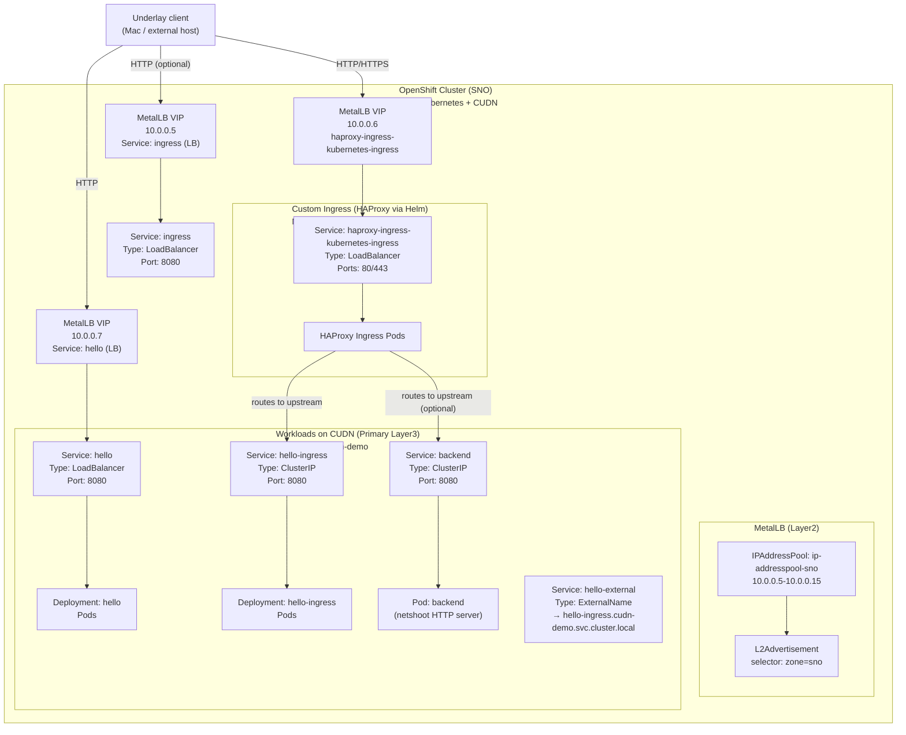
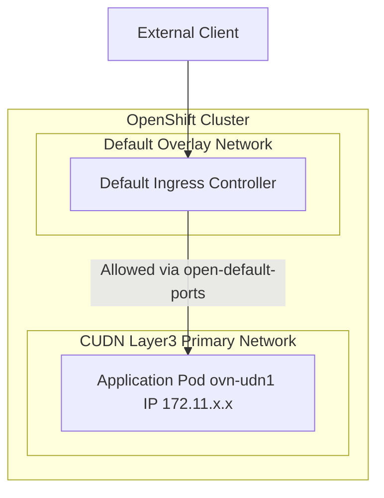
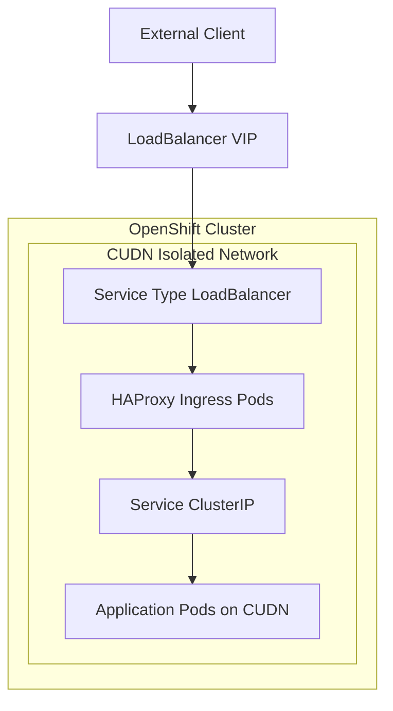

# PoC – Exposing CUDN Workloads to the Underlay Network using MetalLB and Custom Ingress

## Overview

This repository documents a Proof of Concept (PoC) that validates how workloads running on an
**OVN-Kubernetes Cluster User Defined Network (CUDN)** can be exposed to an **underlay network
(10.0.0.0/25)** using **MetalLB** and a **custom HAProxy ingress controller**.

---

## Environment

- **OpenShift**: 4.18.x
- **Kubernetes**: v1.31.x
- **CNI**: OVN-Kubernetes
- **Cluster type**: Single Node OpenShift (SNO), on‑prem
- **User Defined Networks**: ClusterUserDefinedNetwork (Layer3, Primary)
- **Load Balancer**: MetalLB (Layer2 mode)
- **Ingress**: HAProxy (custom Helm deployment)

---

## Architecture Pattern

```
[ Underlay Client ]
        |
        v
  MetalLB VIP (10.0.0.x)
        |
 Service (LoadBalancer)
        |
 Custom HAProxy Ingress (CUDN)
        |
 ClusterIP Service
        |
 Application Pod (CUDN Primary IP)
```

## Architecture diagram



### Key characteristics

- Pods use a **CUDN Layer3 primary network**
- Services of type `LoadBalancer` receive IPs from the **underlay subnet**
- Traffic enters the cluster through MetalLB
- A **custom ingress controller** handles HTTP routing
- The default OpenShift router is not used (it is not CUDN-aware)

---

## Underlay-Exposed Services (10.0.0.x)

The following services are exposed directly to the underlay network:

| Service name                          | Type         | External IP | Purpose |
|--------------------------------------|--------------|-------------|---------|
| haproxy-ingress-kubernetes-ingress   | LoadBalancer | 10.0.0.6    | Main ingress entry point (HTTP/HTTPS) |
| hello                                | LoadBalancer | 10.0.0.7    | Direct exposure of a test application |
| ingress                              | LoadBalancer | 10.0.0.5    | Auxiliary ingress test (optional) |

Only these services are expected to be reachable from the underlay network.

---

## MetalLB Configuration

MetalLB is configured in **Layer2 mode** to advertise IPs from the underlay network.

### IPAddressPool

- **Name**: `ip-addresspool-sno`
- **Range**: `10.0.0.5 – 10.0.0.15`
- **autoAssign**: enabled
- **Label**: `zone: sno`

### L2Advertisement

- Advertisement is based on a **label selector** (`zone: sno`)
- Suitable for Single Node OpenShift environments

All `LoadBalancer` services reference this pool via:

```yaml
metallb.io/address-pool: ip-addresspool-sno
```

---

## Custom HAProxy Ingress (Helm)

The default OpenShift router is not CUDN-aware.  
A custom **HAProxy ingress controller** is therefore deployed using Helm.

```
 $ helm repo add haproxytech https://haproxytech.github.io/helm-charts
 $ helm repo update
 $  helm install haproxy-ingress haproxytech/kubernetes-ingress -n cudn-demo -f ./values.yaml
```


Helm configuration is stored under:

```
helm/haproxy-ingress/
├── values.yaml
└── install.sh
```

To install the ingress controller:

```bash
bash helm/haproxy-ingress/install.sh
```

---

# Alternatives Evaluated

## Alternative 1: Default Ingress Controller with CUDN Open Ports

This alternative evaluates the use of the **cluster default ingress controller**
to expose workloads running on a ClusterUserDefinedNetwork (CUDN).

The application pods are attached to a **CUDN Layer3 primary network**, and traffic
is allowed from the default ingress controller by using the annotation:

### Cluster default ingress controller 
Served via annotation `k8s.ovn.org/open-default-ports`.

For installing the example, please create the resources one by one, as the CUDN will make the namespace and the pod creation to be a bit delayed. 

```bash
# Be located at the default-ingress folder
oc apply -f 1_cudn.yaml

oc apply -f 2_namespaces.yaml

oc apply -f 3_netpol.yaml

oc apply -f 4_app.yaml
```

Once installed, we can check if the app is being served with TLS edge termination: 

```bash
curl -s -m 1 \
  https://$(oc get route \
      -n net-demo-ingress hello-openshift \
      -ojsonpath='{.spec.host}')
```

And it will result in the following output
 
```
Served via a default Ingress Controller in the default network!
```

We observe that the pod has an ovn-udn1 interface with an IP given within the range 172.11.0.0/16 as specified in the CUDN CRD

```json
[
  {
    "name": "ovn-kubernetes",
    "interface": "eth0",
    "ips": [
      "10.131.0.125"
    ],
    "mac": "0a:58:0a:83:00:7d",
    "dns": {}
  },
  {
    "name": "ovn-kubernetes",
    "interface": "ovn-udn1",
    "ips": [
      "172.11.1.4"
    ],
    "mac": "0a:58:ac:0b:01:04",
    "default": true,
    "dns": {}
  }
]
```
Also, we can check, that we cannot access the CUDN open ports from the default network, but it's possible to access from the default ingress contoller pods

```bash
# Retrieve the pod IP
POD_IP_DEFAULT_NETWORK=$(oc get pod --selector app=hello-openshift -ojsonpath="{.items[0].status.podIP}")

# It should return an IP within the Pod default overlay network.
echo $POD_IP_DEFAULT_NETWORK

# From the default ingress controller the traffic is allowed
POD_INGRESS_CONTROLLER_DEFAULT=$(oc get pod \
    -n openshift-ingress \
    --selector ingresscontroller.operator.openshift.io/deployment-ingresscontroller=default \
    -ojsonpath='{.items[0].metadata.name}')

oc exec \
    -n openshift-ingress \
    $POD_INGRESS_CONTROLLER_DEFAULT \
    -- curl -m 2 -s http://$POD_IP_DEFAULT_NETWORK:8080

# Not possible to access the app port 8080 via the default network IP from the CUDN
oc debug -n net-demo-ingress -- curl -m 2 -s http://$POD_IP_DEFAULT_NETWORK:8080

# Not possilbe to access the app port 8080 via the default network IP form the default network
oc debug -n default -- curl -m 2 -s http://$POD_IP_DEFAULT_NETWORK:8080
```


## diagram – Default Ingress Controller



## Alternative 2: Isolated CUDN with Community HAProxy Ingress Controller

This alternative evaluates a **fully isolated CUDN** combined with a
**community HAProxy ingress controller** deployed via Helm.

In this setup:
- The workload runs on a dedicated CUDN
- A custom ingress controller is deployed inside the same CUDN
- Traffic enters the cluster via a `LoadBalancer` service

### Deployment flow

Only as an example, we check the setup with a custom HAProxy ingress controller installed with a Helm Chart. 

```bash
# Be located at the default-ingress folder
oc apply -f 1_cudn.yaml

oc apply -f 2_namespaces.yaml

oc apply -f 3_app.yaml

oc apply -f 4_sa.yaml

helm repo add haproxytech https://haproxytech.github.io/helm-charts
helm repo update
helm install haproxy-ingress haproxytech/kubernetes-ingress \
     -n net-demo-isolated \
     -f ./5_values.yaml \
     -f ./5_values-aro.yaml

# We create the ingress object via the external name
oc apply -f 6_ingress.yaml
```
Now, we can check from a random node, that we are able to reach the ingress controller via the Load Balancer IP. In this example, this has been tested on ARO, so we need to retrieve the Load Balancer IP and we check from a Random node

```bash
LOAD_BALANCER_IP=$(oc get svc \
        -n net-demo-isolated haproxy-ingress-kubernetes-ingress \
        -ojsonpath='{.status.loadBalancer.ingress[0].ip}')

RANDOM_NODE_INDEX=$(( RANDOM % 6 ))
TEST_NODE=$(oc get node \
        -ojsonpath={.items\[$RANDOM_NODE\].metadata.name})

# Check how to access the cluster 
oc debug node/$TEST_NODE \
        -- curl -s -m 2 -H "Host: ingress.hello.com" $LOAD_BALANCER_IP
```

The latter will show the served content from the Ingress Controller

```
(base) ➜  isolated oc debug node/$TEST_NODE \
        -- curl -s -m 2 -H "Host: ingress.hello.com" $LOAD_BALANCER_IP
Temporary namespace openshift-debug-gwrd8 is created for debugging node...
Starting pod/saa-obs-5tvt7-worker-germanywestcentral1-kkfsh-debug-cwxrl ...
To use host binaries, run `chroot /host`. Instead, if you need to access host namespaces, run `nsenter -a -t 1`.
Served from an isolated Cluster User Defined Network.

Removing debug pod ...
Temporary namespace openshift-debug-gwrd8 was removed.
```
### Architecture diagram




## Conclusion

This PoC demonstrates a **clean and supportable architecture** for exposing CUDN-based workloads
to an underlay network using **MetalLB and a custom ingress controller**.

It avoids the operational and architectural limitations of Localnet Secondary networks and provides
a solid foundation for future evolution (e.g. BGP-based MetalLB).
